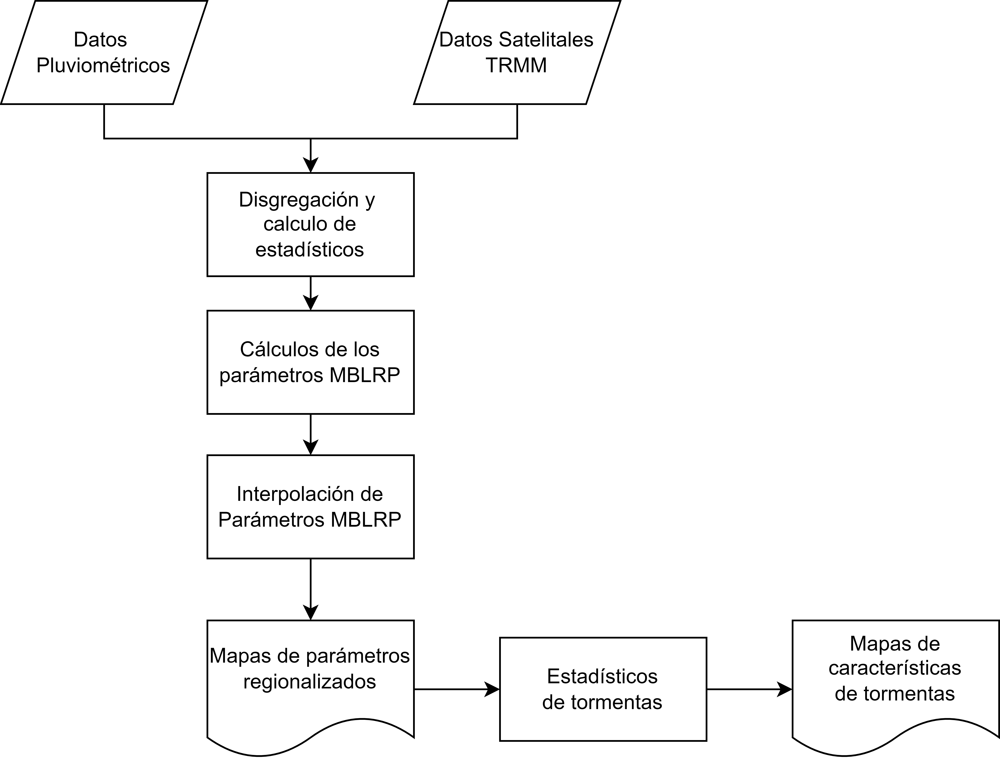

# Modelo Modificado Pulso Rectangular de Bartlett-Lewis (MBLRP)
Este repositorio contiene los codigos utilizados para la regionalización del modelo MBLRP en el Perú.

# Codigos
Flujo de trabajo

- [Disgregacion de datos Pluviometricos con TRMM y sus estadisticos](https://github.com/JoseZevallosR/TrmmCorrection/blob/main/code/TRMM_Correction.ipynb)
- [Calculo de los parametros MBLRP](https://github.com/JoseZevallosR/Bartlet-Lewis_Regionalization/blob/main/scripts/MBLRP_ESTIMACION.R)
- [Interpolacion de los parametros MBLRP](https://github.com/JoseZevallosR/Bartlet-Lewis_Regionalization/blob/main/scripts/PARAMETROS_MBLRP_OK.R)
- [Validacion cruzada](https://github.com/JoseZevallosR/Bartlet-Lewis_Regionalization/blob/main/scripts/VALIDACION_CRUZADA_DE_MBLRP.R)
- [Caracteristicas de tormentas](https://github.com/JoseZevallosR/Bartlet-Lewis_Regionalization/blob/main/scripts/CARACTERISTICAS_DE_TORMENTAS.R)
- [Validacion cruzada graficos](https://github.com/JoseZevallosR/Bartlet-Lewis_Regionalization/blob/main/scripts/VALIDACION_CRUZADA_GRAFICO.R)
- [Simuacion de precipitacion en Namora](https://github.com/JoseZevallosR/Bartlet-Lewis_Regionalization/blob/main/scripts/PRECIPITACION_SIMULADA_NAMORA.R)
